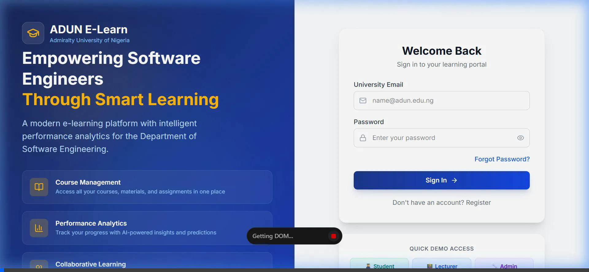

# ADUN E-Learn: Performance Analytics Dashboard 🎓


A modern, responsive, and highly interactive E-Learning System Dashboard built for Admiralty University of Nigeria (ADUN). This application features role-based access control, real-time performance analytics, and a premium glassmorphic user interface.

## ✨ Features

- **Role-Based Dashboards:** Distinct views and features tailored for Students, Lecturers, and Administrators.
- **Premium Glassmorphism UI:** A sleek, modern aesthetic using backdrop blurs, dynamic gradients, and animated hover states.
- **Dark Mode Support:** Seamless toggling between a vibrant light mode and a deep, rich dark mode (`#0f172a`).
- **Performance Analytics:** Interactive charts (using Recharts) to visualize GPA trends, course performance, and AI-driven insights.
- **Interactive Elements:** Staggered entrance animations, responsive sidebars, and custom notification systems.

## 🚀 Demo

Check out the live demo of the user interface (hosted on Vercel):
**[Launch Live Demo](https://e-learning-system-performance-analytics.vercel.app/)**

### UI Enhancements Walkthrough
*Here is a recorded demonstration of the glassmorphic UI, animations, and dark mode capabilities:*



## 🛠️ Tech Stack

- **Framework:** React 19 (Bootstrapped with Vite)
- **Styling:** Tailwind CSS v4 + Tailwind Merge + clsx
- **Icons:** Lucide React
- **Data Visualization:** Recharts
- **Language:** TypeScript

## 📦 Local Installation

To run this project locally on your machine, follow these steps:

1. **Clone the repository**
   ```bash
   git clone https://github.com/newman-theinnovator/e-learning-system-performance-analytics.git
   cd e-learning-system-performance-analytics
   ```

2. **Install dependencies**
   ```bash
   npm install
   ```

3. **Start the development server**
   ```bash
   npm run dev
   ```

4. **View the app**
   Open your browser and navigate to `http://localhost:5173/`

## 🏗️ Project Structure
```text
src/
├── components/     # Reusable UI components (Layout, Sidebar, Topbar)
├── context/        # React Context providers (AuthContext)
├── data/           # Mock data for dashboards and analytics
├── pages/          # Individual Dashboard pages (Student, Lecturer, Admin)
├── types/          # TypeScript interfaces and types
├── App.tsx         # Main application and routing logic
└── main.tsx        # Application entry point
```

## 🤝 Contributing
Contributions are welcome! Feel free to open an issue or submit a Pull Request if you'd like to improve the codebase.

## 📄 License
This project is licensed under the MIT License.